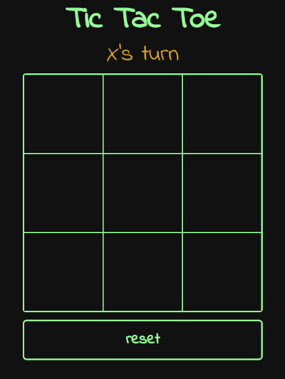
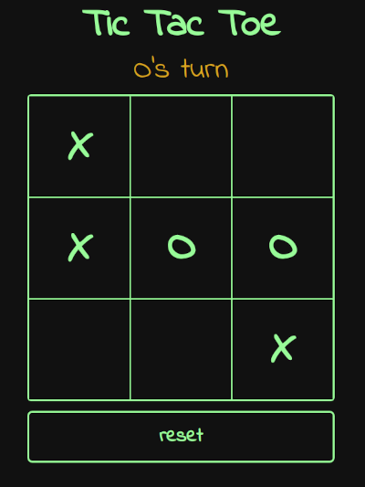
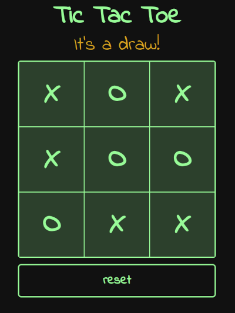

# Tic Tac Toe

## Project info

An interactive two player Tic Tac Toe game. The purpose of this project is to practice creating clean javascript code with factory functions and modular functions.

Project description can be found [here](https://www.theodinproject.com/lessons/javascript-tic-tac-toe)

## Live demo

Live demo available [here](https://jcampbell57.github.io/odin-tic-tac-toe/)

## Table of Contents

* [Features](#features)
* [Technologies utilized](#technologies-utilized)
* [Learning outcomes](#learning-outcomes)
* [Project screenshots](#project-screenshots)
* [Behind the Scenes](#behind-the-scenes)
* [Installation](#installation)

## Features

- Custom CSS font
- Responsive design

## Technologies utilized

- HTML5
- CSS3
- JavaScript ES6

## Learning outcomes

This project helped to reinforce the following skills:

- JavaScript factory functions and modular functions

## Project screenshots

### Tic-tac-toe new game:

 

### Tic-tac-toe mid game:

 

### Tic-tac-toe end game:

 

## Behind the scenes

### Improvements

This project could be improved with:

- Single player mode vs. computer

### Resources

- [CSS reset](https://meyerweb.com/eric/tools/css/reset/)

## Installation

- Clone this repository to your desktop.
- Navigate to the top level of the directory by running `cd odin-tic-tac-toe`.
- Open `index.html` in your browser.
