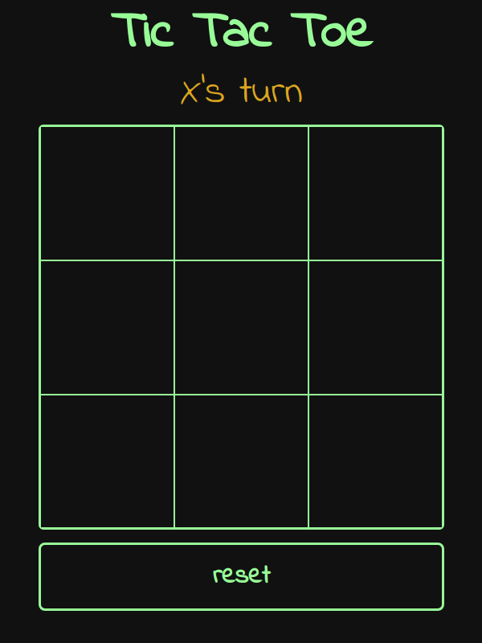
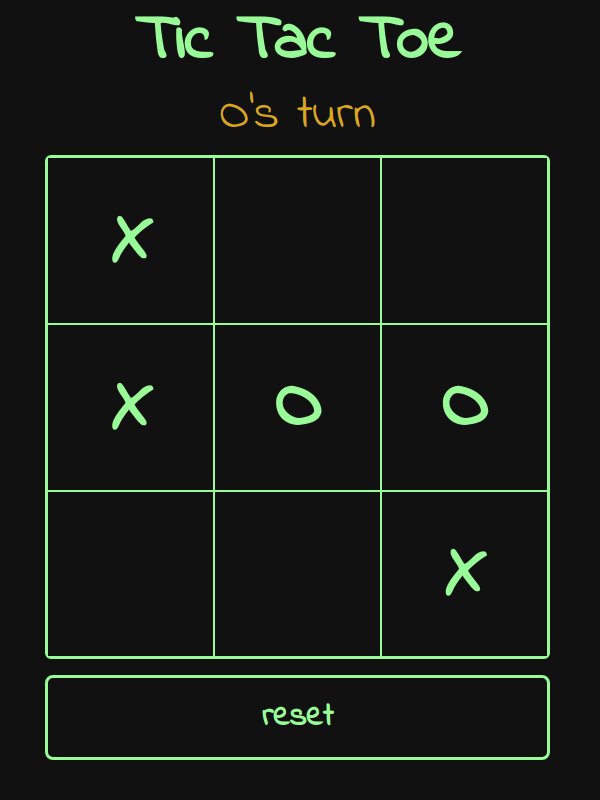
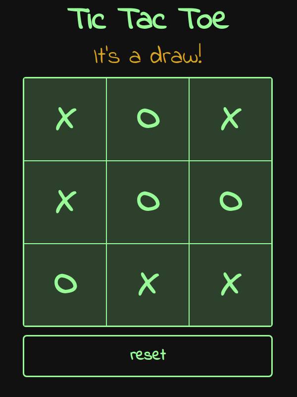

# odin-tic-tac-toe

The focus of this project is to practice creating clean javascript code. Project description can be found here:

https://www.theodinproject.com/lessons/javascript-tic-tac-toe

## Live demo

Live demo available [here](https://jcampbell57.github.io/odin-tic-tac-toe/v2/)

## Features

- Interactive two player Tic-tac-toe-game

## Improvements

This project could be improved with:
- Single player mode vs. computer

## Photos

### Tic-tac-toe new game:

 

### Tic-tac-toe mid game:

 

### Tic-tac-toe end game:

 
